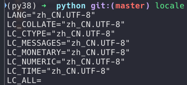
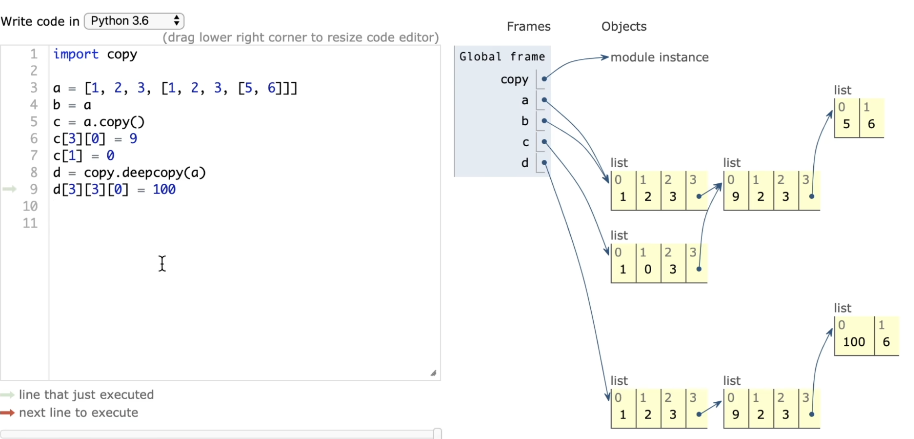

# M1 Pro

### 安装 tensorflow

```bash
conda create -n tf26 python=3.9

conda activate tf26

conda install -c apple tensorflow-deps=2.6.0 
or conda install -c apple tensorflow-deps

python -m pip install tensorflow-macos
python -m pip install tensorflow-metal
```

### conda本地环境操作

```bash
#获取版本号
conda --version 或 conda -V

#检查更新当前conda
conda update conda

#查看当前存在哪些虚拟环境
conda env list 或 conda info -e

#查看--安装--更新--删除包
conda list
conda search package_name# 查询包
conda install package_name
conda install package_name=1.5.0#pip 用==
conda update package_name
conda remove package_name

#创建名为your_env_name的环境
conda create --name your_env_name
#创建制定python版本的环境 
conda create --name your_env_name python=2.7
conda create --name your_env_name python=3.6
#创建包含某些包（如numpy，scipy）的环境
conda create --name your_env_name numpy scipy
#创建指定python版本下包含某些包的环境
conda create --name your_env_name python=3.6 numpy scipy

#激活环境
source activate your_env_name

#删除虚拟环境
conda remove -n your_env_name --all
conda remove --name your_env_name --all

#复制某个虚拟环境
conda create --name new_env_name --clone old_env_name

#在某个指定环境管理包
conda list -n your_env_name
conda install --name myenv package_name 
conda remove --name myenv package_name

#换源 修改~/.condarc
channels:
  - defaults
show_channel_urls: true
default_channels:
  - https://mirrors.tuna.tsinghua.edu.cn/anaconda/pkgs/main
  - https://mirrors.tuna.tsinghua.edu.cn/anaconda/pkgs/r
  - https://mirrors.tuna.tsinghua.edu.cn/anaconda/pkgs/msys2
custom_channels:
  conda-forge: https://mirrors.tuna.tsinghua.edu.cn/anaconda/cloud
  msys2: https://mirrors.tuna.tsinghua.edu.cn/anaconda/cloud
  bioconda: https://mirrors.tuna.tsinghua.edu.cn/anaconda/cloud
  menpo: https://mirrors.tuna.tsinghua.edu.cn/anaconda/cloud
  pytorch: https://mirrors.tuna.tsinghua.edu.cn/anaconda/cloud
  pytorch-lts: https://mirrors.tuna.tsinghua.edu.cn/anaconda/cloud
  simpleitk: https://mirrors.tuna.tsinghua.edu.cn/anaconda/cloud
```

### 配置OpenCV 环境

```bash
brew install opencv 
pip install opencv-contrib-python
```

### Jupyter notebook

```bash

```

### 编码

`locale`:显示mac中编码信息为utf-8



Unicode 万国码

1. 支持所有国家语言
2. 跟所有国家的编码有映射关系
3. 2-4个字节存一个字符,比ASCII码要多一倍

为了优化unicode的占空间

提出utf-8

- 英文占一个字节
- 西欧占两个字节
- 中文占三个字节

utf-8是可变长的编码,适合存到文件里或网络发送

python解释器默认用utf-8执行py文件

**但内存中依然是unicode编码,python交互模式下执行时定义字符串编码为unicode,在 Python 中，字符串本身是以 Unicode 格式存储的**


任意编码转成unicode的过程,都叫解码decode

unicode转成utf-8的过程,叫做编码encode

相当于unicode是第一人称


gbk—>utf-8

1. 直接转成unicode
    1. py3 print的时候内存里所有字符都是unicode,unicode 是万国码
    2. Py3,文件默认编码都是utf-8
    3. Py2,print的时候内存中默认ascii
2. 转成utf-8

### 小知识

#### python中函数和方法区别

**函数（Function）：**

- 函数是独立的代码块，可以在模块或脚本中定义，并可以在模块或脚本的任何地方调用。

- 函数可以定义在类之外或类之内。
- 函数是通过函数名直接调用的


**类的方法（Method）：**

- 方法是定义在类中的函数，它是类的一个组成部分。

- 方法需要通过类的实例来调用，并且第一个参数通常是 self，表示类的实例本身。
- 方法必须通过对象（实例）来调用。

#### python中类内变量(属性)和类外变量

**类内变量(属性)**

- 实例(对象)变量(实例属性)：在类的方法（通常是 __init__ 方法）中定义，属于类的实例，每个实例有自己的实例变量。只在创建实例时存在，并且仅在该实例的方法中可访问。生命周期与实例的生命周期相同。当实例被销毁时，实例变量也会被销毁。

- 类变量(类属性)：在类体中定义，属于类本身，所有实例共享相同的类变量。在类的所有实例之间共享，类的所有实例都能访问到相同的类变量。生命周期与类的生命周期相同，只要类存在，类变量就存在。

    ```python
    class MyClass:
        class_var = 'I am a class variable'  # 类变量
    	def __init__(self, value):
        	self.instance_var = value  # 实例变量
    ```

**类外变量**

- 全局变量：在类外部定义的变量，可以在模块或脚本的任何地方访问。在模块或脚本的所有函数和方法中可访问，只要它们在全局作用域内定义。在整个模块或脚本运行期间存在，直到模块或脚本结束。
- 局部变量：在函数或方法内部定义的变量，只在该函数或方法内部有效。只能在定义它的函数或方法内部访问，函数调用结束后局部变量会被销毁。只在定义它的函数或方法执行期间存在，执行完毕后被销毁。

```python
global_var = 'I am a global variable'  # 全局变量

def my_function():
    local_var = 'I am a local variable'  # 局部变量
    print(local_var)
```


#### python中对象就是实例


#### 深浅拷贝



b = a[:]  # 浅拷贝 a 到 b

b=a.copy()  # 浅拷贝 a 到 b

b=copy.copy(a)# 浅拷贝 a 到 b


b = copy.deepcopy(a)# 深拷贝 a 到 b

# Pytorch

