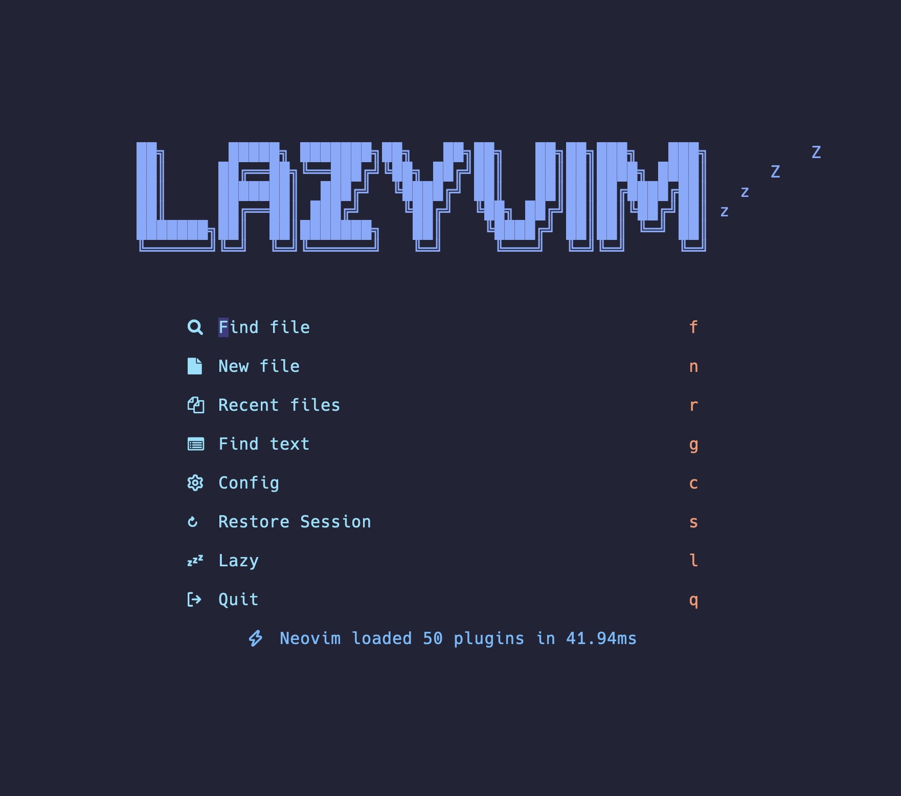

# VIM



> [vim视频课程](https://www.imooc.com/learn/1129)配合[vim文字教程](https://www.tuyrk.cn/imooc/1129-vim/)进行学习
> 
> **VIM四种模式：普通(normal)，插入，命令，可视化(visual)。**

## 普通模式

### 切换模式

#### 进入插入模式

> | 操作  | 说明           |
> | --- |:------------:|
> | `i` | 光标位置前插入      |
> | `a` | 光标后一位插入      |
> | `o` | 光标所在行下新一行    |
> | `I` | 光标所在行最前方位置插入 |
> | `A` | 光标行最后位置插入    |
> | `O` | 光标所在上一行插入    |

#### 进入可视化模式

> - `v/V` 进行可视化（光标/整行选中）操作,`ctrl+v`可实现块状操作；
> 
> - `y`命令可以复制选中的块，`p`可以粘贴复制的块，`d`或`x`可以删除选中的块。命令模式中的操作

#### 快速切换 插入模式 和 普通模式 模式

> - insert->normal: `ctrl+c` 或者 `ctrl+[`
> - 使用`gi`从normal 模式切换到 insert 模式，且到上次编辑的地方

### 光标移动

#### 单词移动

> - `w/W`  移动到下一个word/WORD 开头
> 
> - `e/E ` 移动到下一个 word/WORD 结尾
> 
> - `b/B`  移动到上一个 word/WORD 开头 (backword)

#### 行间搜索移动

> - `f{char}` 当前光标往行后搜索字符, 分号(;)下一个找到的字符，逗号(,)上一个找到的字符(无需打出大括号,如打ft就是搜索一行内的t字符)
> 
> - `F{char}`  当前光标往前搜索字符
> 
> - `0` 移动到行首第一个字符
> 
> - `^` 移动到第一个非空白字符(不常用)
> 
> - `$`移动到行尾
> 
> - `g_` 移动到行尾非空白字符(不常用)

#### 垂直移动(不常用)

> - 使用括号`()`在句子间移动
> 
> - 使用`{}`在段落中移动
> 
> - 可用`esay-motion`插件移动

#### 页面移动

> - `gg`文件开头
> - `G`文件结尾,使用`ctrl+o`快速返回
> - `H`: 屏幕的开头(Head)
> - `M`: 屏幕的中间(Middle)
> - `L`: 屏幕的结尾(Lower)
> - `ctrl+u`: 上翻页（upword） (弃用)
> - `ctrl+f`: 下翻页（forword）（弃用）
> - `zz`: 将光标所属行置于屏幕中间,方便

### 编辑操作

> `u`：撤销操作
> 
> `Ctrl+r`：反向撤销

#### 增加字符

> - 使用`a/i/o`进入插入模式编辑

#### 删除字符

> - `x`删除后面一个字符,4x删除后面四个字符
> - `dw`删除后面一个单词,包含括号
> - `diw`删除后面一个单词,不包含括号(不常用)
> - `dd`删除一行,4dd删除四行
> - `dt)`删除小括号内容
> - `d0`删除到行首
> - `d$`删除到行尾

#### 修改字符

> - `r`替换单个字符,R替换多个字符（replace）
> - `s`删除字符并进入插入模式,`S`删除整行并进入插入模式（substitute）
> - `cw`删除单词并进入插入模式,`ct)`删除小括号内单词并进入插入模式,`C`从光标处删除到行尾部,并进入插入模式（change）

#### 查询字符

> - 使用`/`或者`?`进行前向或者反向搜索
> - 使用`n`或者`N`跳转到下一个或者上一个匹配
> - 使用`*`或者`#`进行当前光标所在单词的前向或者后向匹配

### 多文件操作

> - Buffer是指打开的一个文件的内存缓冲区
> - Window是Buffer可视化的分割区域
> - Tab可以组织Window为一个工作区
> 
> 

Buffer（缓冲区）

> - Vim打开一个文件后会加载文件内容到缓冲区
> - 之后的修改都是针对内存中的缓冲区，并不会直接保存到文件
> - 直到执行`:w`（write）的时候才会把修改的内容写入到文件里
> 
> Buffer切换‰
> 
> - 使用`:ls`会列举出当前缓冲区，然后使用`:b n`跳转到第n个缓冲区
> - `bpre`、`bnext`、`bfirst`、`blast`
> - `:b buffer_name`、`:b filename`，`tab`会自动补全`buffer_name`
> - `:e b.txt`编辑(edit)b.txt

Window窗口：

> - 一个缓冲区可以分割成多个窗口，每个窗口也可以打开不同的缓冲区
> 
> - `<Ctrl+w>s`水平分割，`<Ctrl+w>v`垂直分割。或者`:sp`、`:vs`
> 
> - 每个窗口可以继续被无限分割（屏幕是否足够大）
>   
>   
> 
> 如何切换窗口?
> 
> | 命令          | 用途         |
> |:----------- |:---------- |
> | `<Ctrl+w>w` | 在窗口间循环切换   |
> | `<Ctrl+w>h` | 切换到左边的窗口   |
> | `<Ctrl+w>j` | 切换到下边的窗口   |
> | `<Ctrl+w>k` | 切换到上边的窗口   |
> | `<Ctrl+w>l` | 切换到右边的窗口   |
> | `<Ctrl+w>L` | 将当前窗口移动到右边 |
> | `<Ctrl+w>H` | 将当前窗口移动到左边 |
> 
> 如何重排窗口？
> 
> 重排窗口可以改变窗口的大小`:h window-resize`查看文档
> 
> | 命令              | 用途             |
> |:--------------- |:-------------- |
> | `<Ctrl+w>=`     | 使所有窗口等宽、等高     |
> | `<Ctrl+w>_`     | 最大化活动窗口的高度     |
> | `<Ctrl+w>       | `              |
> | `[n] <Ctrl+w>_` | 把活动窗口的高度设为[n]行 |
> | `[n] <Ctrl+w>   | `              |

Tab

> - Tab是可以容纳一系列窗口的容器,使用`:h tabpage`查看文档
> - Vim的Tab和其他编辑器有所不同，可以将其想象为Linux的虚拟桌面
> - 比如一个Tab全用来编辑Python文件，一个Tab全是HTML文件
> - 相比窗口，Tab一般使用较少，Tab太多管理起来也比较麻烦
> 
> tab操作
> 
> | 命令                      | 用途                 |
> |:----------------------- |:------------------ |
> | `:tabnew {filename}`    | 在新标签中打开{filename}  |
> | `:tabe[dit] {filename}` | 在新标签中打开{filename}  |
> | `<Ctrl+w>T`             | 把当前窗口移动到一个新标签页     |
> | `:tabc[lose]`           | 关闭当前标签页及其中的所有窗口    |
> | `:tabo[nly]`            | 只保留活动标签页，关闭其他所有标签页 |
> 
> Tab切换操作
> 
> | Ex命令             | 普通模式命令   | 用途            |
> |:---------------- |:-------- |:------------- |
> | `:tabn[ext] {N}` | `{N} gt` | 切换到标签为{N}的标签页 |
> | `:tabn[ext]`     | `gt`     | 切换到下一个标签页     |
> | `tabp[revious]`  | `gT`     | 切换到上一个标签页     |
> 
> - `:vs c.txt`：垂直分割打开c.txt
> - `:tabnew duck.py`：在新的标签页打开duck.py

### 文本对象

> 之前已经使用过文本对象了，比如`dw`删除一个单词
> 
> `[number] <command> [text object]`。次数+命令+文本对象
> 
> - `number`表示次数，`command`表示命令：`d`(delete)、`c`(chage)、`y`(yank)
> 
> - `text object`是要操作的文本对象，比如单词`w`、句子`s`、段落`p``
>   
>   `vi"`：选中""中的内容。另外还`()`、`{}`、`[]`等。
>   
>   `viw`：表示inner word。`viw`命令首先`v`进入选择模式，`iw`将选中当前单词
>   
>   `vaw`：表示around word。它不但会选中当前单词，还会包含单词之后的空格
>   
>   `ci"`：删除`""`中的内容，并进入插入模式。另外还有`()`、`{}`、`[]`等。

## 插入模式

> - `ctrl+h` 删除上一个字符
> 
> - `ctrl+w` 删除上一个单词
> 
> - `ctrl+u` 删除当前行
> 
> - `ctrl+a` (终端) 快速移动到开头
> 
> - `ctrl+e` (终端)快速移动到结尾
> 
> - `ctrl+f` (终端)光标后移
> 
> - `ctrl+b` (终端)光标前移

## 命令模式

基础设置

> - 使用`set nu`  设置行号
> - 用`syntax on`开启语法高亮,syntax off关闭语法高亮
> - `sp`(split水平)、`vs`(vertical split垂直)可进行分屏编辑
> - `% s/str1/str2/[g]` 可进行文本[全局]替换。 (中括号内容可以不用,代表全局)
>   - 比如使用`% s/java/python/g`全局替换，将`java`替换为`python`
> - 使用help {}查询
>   - 如`help c`
> - `set hls` 高亮搜索,`set incsearch`查找焦点移动

查找替换文本

> substitute命令允许查找并且替换文本，并且支持正则表达式
> 
> `:[range] s[ubstitute]/{pattern}/{string}/[flags]`
> 
> - `range`表示范围。 比如：`10,20`表示10-20行，`%`表示全部
> 
> - `pattern`是要替换的模式
> 
> - `string`是替换后的文本
> 
> - `flags`是替换标志位
>   
>   - `g`(flobal)表示全局范围内执行
>   
>   - `c`(confirm)表示确认，可以确认或者拒绝修改
>   
>   - `n`(number)报告匹配到的次数而不替换，可以用来查询匹配次数
> 
> 实例:
> 
> - 在全局范围内将self替换为this `:% s/self/this/g `
> 
> - 在1-6行将self替换为this  `:1,6 s/self//n `
> 
> - 利用正则，将quack替换为jiao，而不替换do_quack  `:% s/\<quack\>/jiao/g`

## Vim 配置

```shell
vi ~/.vimrc #编辑 vim 配置文件
```

vim 文件设置:

```vim
set number
syntax on

let mapleader=','
inoremap <leader>w <Esc>:w<cr>

"i 代表 insert 模式,no代表不,re 代表递归 recusion,map 代表映射
inoremap jj <Esc>

noremap <C-h> <C-w>h
noremap <C-j> <C-w>j
noremap <C-k> <C-w>k
noremap <C-l> <C-w>l

"json 格式化
"com! 代表命令模式
com! FormatJSON %!python3 -m json.tool
```
