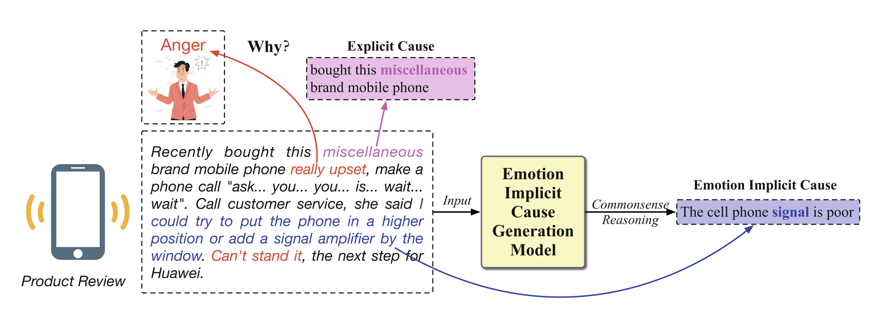
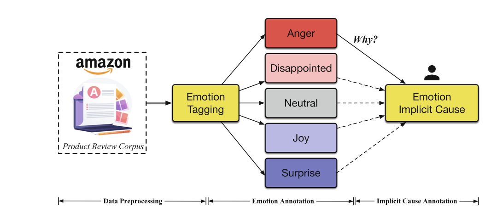
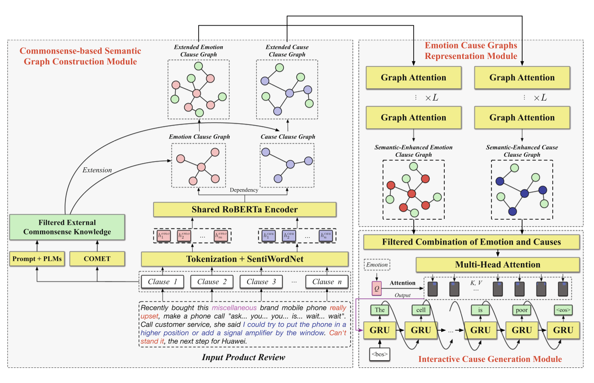

# 情感识别

## 背景

​		随着互联网的快速发展，涌现出大量的主观文本，如电子商务评论和心理咨询对话。这些内容包含丰富的用户情感，包括复杂的情感、感知、思想和行为。 这些情感文本具有丰富知识，反映了人们的习惯和偏好。因此，探索这些主观来源中蕴含的知识具有很高的价值。
例如，在产品或服务管理中，公司可以通过分析评论中的情感和潜在原因有效地把握用户的真实需求。 这种分析可以帮助明确改进和优化的方向，从而推出符合消费者期望的产品和服务。

​		情感原因分析近年来引起了广泛关注。 以往的研究主要集中在情感-原因提取（ECE）和情感-原因对提取（ECPE）上。 ECE旨在从给定的文本中提取情感的原因从句，而ECPE用于提取所有情感从句和原因从句的对应关系。
​		在实际应用中，情感表达往往很复杂。 情感的隐含原因可能在文本中没有直接提及，但人类可以通过对文本语义的常识推理方便地理解它们。如图1，用户表达了“愤怒”的情感。 虽然以前关于ECE的工作可以提取出“购买了这个杂牌手机”的明确情感原因，但它无法发现“愤怒”的更本质原因，即“手机信号差”。这个原因是隐藏的，在文本中没有出现。 为了发现它，我们需要对复杂内容进行常识推理。 由于这个原因不是给定文本中的一个片段，传统的基于提取的方法可能会失败。 由于缺乏常识推理能力，这些方法很难推断出文本背后的复杂上下文和背景知识。 因此，这个主题具有很大的研究价值。 隐含原因提供了对用户意见的更深入理解，为产品运营提供更准确的决策支持。

图1 “愤怒”是隐含的，但文本中没有提到

​		具体来说，我们首先要识别文本中潜在的情感和原因分句。为了获取背景知识，我们从大型语言模型   (LLM)GPT和知识图谱(KG)ATOMIC中检索相关的常识性内容。LLM的知识覆盖面很大，但可能存在许多无关噪声，而知识图谱则覆盖小范围的高质量知识。然后，我们应用图网络来整合这些内容，并学习它们的结构上下文。为了过滤不相关的噪音， 我们应用启发式规则和多头注意机制，从而得出情感和隐合含原因的强关联 。最后，我们将隐含原因与相应的情感进行解码。为了了评估我们的模型， 我们创建了一个名为EICDset的大型语料库。对其进行的实验证明了我们模型的有效性。总之，本文的主要贡献包括：

1. 我们提出了“情感隐含原因发现“(EICD)这一新任务，旨在发现文本中显性原因事件背后的隐含原因。

2. 我们为这项任务建立了一个高质量的数据集EICDset，并提出了一个新颖的生成模型，该模型可直接生成内隐情感原因。

3. 我们进行了大量实验，以全面评估我们提出的模型。

​		在本文中，我们建议利用具有大量人类共享知识的大型语言模型来获取更全面的信息。通过设计提示语句，我们允许大型语言模型GPT灵活生成与分句中中原因事件相关的常识。

## 问题

​		本文主要研究产品情感原因分析任务，旨在从产品评论中找到某些情感的本质原因。目前的研究只研究文本中某些spans（张成子空间）的显性原因，但一些关键和有用的原因可能表达得很模糊，它们可能没有提及，但可以从文本语义学中推断出来，它们可以捕捉到深层原因，解释一些未知现象，从而为市场研究和产品优化等应用提供有利支持。 为了解决这个问题，我们在本文中提出了一项新的情感隐含原因发现（EICD）任务。 我们开发了一种新颖的方法，可以根据上下文和常识知识推断出隐含原因。 我们的方法首先从大型语言模型中检索相关知识，构建情感和潜在原因的推理图。 然后，我们对图中的结构知识进行编码，并通过演绎推理推断出隐含原因。 为了评估我们的方法，我们根据亚马逊产品评论构建了一个名为EICDset的大型数据集。 对其进行的实验证明了我们模型的有效性。

## 准备工作

- 情绪原因分析

​		提出了“情感原因提取“(Emotion Cause Extraction)的概念。早期的情感原因提取任务主要是基于规则的方法。研究人员通过分析语料库的语言特征，在经验的指导下开发了基于规则的系统，并利用这些规则提取出导致情绪变化的因果事件。随着机器学习方法和深度学习方法的引入，这些模型的性能显著提高。利用W3C情感标记语言方案在新浪城市新闻上构建了情感原因提取语料库，该语料库受到广泛关注，目前已被视为幼教研究的基准数据集。利用位置嵌入对出现在情感分句附近的原因分句进行建模。认识到情感和原因高度相关， 并能相互提供信息，因此提出了一种多任务学习框架，可同时进行情感识别和原因提取。

​		在ECE任务中，原因提取之前需要先进行情感注释，这限制了其潜在的应用场景。为了解决这一限制，提出了一种名为情感原因对提取(ECPE)的新任务。

- 常识知识利用

​		常识知识利用可以为模型带来合理的外部知识。在情感原因提取的研究中，一些作品研究了如何利用外部 知识库来引入常识性知识。

​		通过检索外部知识，我们能够在某些特定关系下获得该条款的有针对性的常识性知识。然而，这种知识通常局限于覆盖范围有限的固定类型的关系。迅速学习最近作为预训练语言模型的新范式越来越受到关注。这是一种从大型语言模型中提取隐性知识的技术，可以设计有提示来指导大型语言模型生成与特定任务匹配的内容。

- 构建语料库

​		在这项工作中，我们通过在多语种亚马逊评论语料库中添加附加注释，为EICD任务构建了一个新的语料库。原始数据集包括来自亚马逊的产品评论 ，其中每条记录都包含评论文本、评论标题、星级、匿名评论者ID、匿名产品ID和粗粒度产品类别。该数据集包括以下六种语言的评论(英语、日语、德语、法语、汉语和西班牙语)，标注时间为2015年11月1日至2019年11月1日。我门的研究侧重于该数据集的英语子集，并使用新注释对其进行增强，以支持EICD任务。

 
图2 语料库构建过程的概览

**数据预处理：**为了确保我们的模型暴露在不同的情绪中，我们采用基于每个评论的星级的随机抽样策略从原始数据集中选择数据。由于星级在一定程度上传达了评论者的态度，这种方法允许我们为模型提供捕捉一系列潜在态度的数据。具体来说，我们从语料库中的每个五星评级（从1-5）中随机选择了10,000个样本。为了便于发现情绪的原因，我们排除了没有明显情绪的评论。
**情感注释：**为了在内隐情感原因发现任务中通过情感来指示原因发现，我们用情感类别对数据集中的评论进行注释。具体来说，我们通过分析用户在产品评论中传达的主导情绪，建立了五个情感类别，即愤怒、失望、中性、快乐和惊讶。我们的策略基于Ekman对情感类别的成熟研究，并考虑到评论的原始分类为五颗星。在这个过程中，我们使用了三个同时进行注释的注释者。其中两个注释者独立评估每个实例的情绪。当两个注释者之间存在分歧时，第三个注释者充当仲裁者来解决分歧。
**隐性原因注释：**识别隐性原因是理解语言表达的情感的关键因素。为了确保准确标记这些原因，我们坚持三个基本原则：（1）隐性原因不同于显性原因事件，通常不会在给定的文本中明确说明。因此，我们避免在注释中有太多连续的文本与给定的文本重叠。具体来说，我们设置了长度重叠的连续文本不超过3个；（2）为了简单易读性，我们指定了标准化的标签格式，从短语“因为”开始；（3）我们将原因文本的长度限制在不超过30个单词。这些原则旨在促进有效识别给定文本中情绪的隐性原因。

图3 语料库中的样本

## 方法

模型的整体架构，它由三个主要组成部分组成：

- 基于常识的语义图构造模型（CSG）
- 情感和原因图表示模块（ECG）
- 情绪隐含原因发现（EICD）

图4 方法的整体架构

​		我们为 EICD 任务提出了一种新颖的情感隐含原因生成模型。含若干条款和与之对应的情感 *e*。我们将发现情绪的隐含原因视为文本生成任务，使用基于常识推理的模型生成触发情绪的隐含原因。

​		我们模型的整体架构如图所示，它由三个主要部分组成：基于常识的语义图构建模块（CSG）、情感和原因图表示模块（ECG），以及隐因生成模块（ICG）。我们首先将文档 *D* 中的所有分句作为模型的输入。随后，CSG 模块通过分析给定文档中的语义关系和相关常识知识，构建出原因条款和潜在情感条款的语义图。ECG 模块在结合常识知识和上下文语义的同时，对图的结构特征进行表征。ICG 模块首先识别情绪和原因的重要候选组合，然后找出它们之间关联性很强的因果组合，最后对隐含原因进行解码。每个模块的结构如图4。

## 改进思路

在未来的工作中，还需进一步提高模型的性能和可靠性。此外，应当扩展其应用场景，以提高其实用性。