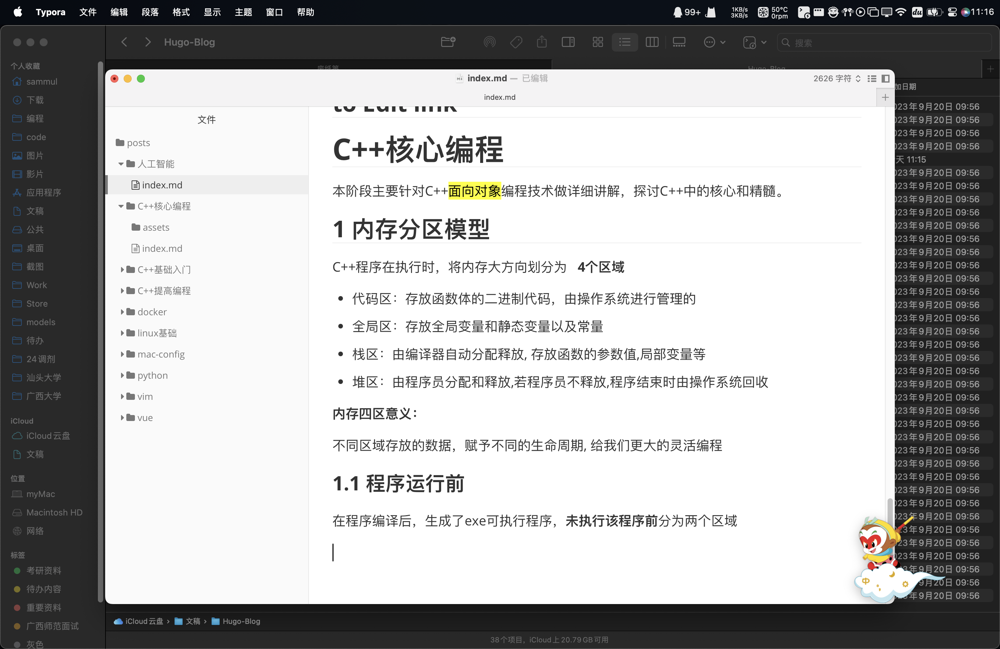

# C++核心编程

本阶段主要针对C++<mark>面向对象</mark>编程技术做详细讲解，探讨C++中的核心和精髓。

## 1 内存分区模型

C++程序在执行时，将内存大方向划分为   **4个区域**  

- 代码区：存放函数体的二进制代码，由操作系统进行管理的
- 全局区：存放全局变量和静态变量以及常量
- 栈区：由编译器自动分配释放, 存放函数的参数值,局部变量等
- 堆区：由程序员分配和释放,若程序员不释放,程序结束时由操作系统回收

**内存四区意义：**

不同区域存放的数据，赋予不同的生命周期, 给我们更大的灵活编程

### 1.1 程序运行前

在程序编译后，生成了exe可执行程序，**未执行该程序前**分为两个区域

---
title: "C++核心编程"
date: 2023-05-18T00:57:49+08:00
# weight: 1
# aliases: ["/first"]
tags: ["c++"]
author: "Me"
# author: ["Me", "You"] # multiple authors
showToc: true
TocOpen: false
draft: false
hidemeta: false
comments: false
description: "Desc Text."
canonicalURL: "https://canonical.url/to/page"
disableHLJS: true # to disable highlightjs
disableShare: false
disableHLJS: false
hideSummary: false
searchHidden: true
ShowReadingTime: true
ShowBreadCrumbs: true
ShowPostNavLinks: true
ShowWordCount: true
ShowRssButtonInSectionTermList: true
UseHugoToc: true
cover:
    image: "<image path/url>" # image path/url
    alt: "<alt text>" # alt text
    caption: "<text>" # display caption under cover
    relative: false # when using page bundles set this to true
    hidden: true # only hide on current single page
editPost:
    URL: "https://github.com/<path_to_repo>/content"
    Text: "Suggest Changes" # edit text
    appendFilePath: true # to append file path to Edit link
---
# C++核心编程

本阶段主要针对C++<mark>面向对象</mark>编程技术做详细讲解，探讨C++中的核心和精髓。

## 1 内存分区模型

C++程序在执行时，将内存大方向划分为   **4个区域**  

- 代码区：存放函数体的二进制代码，由操作系统进行管理的
- 全局区：存放全局变量和静态变量以及常量
- 栈区：由编译器自动分配释放, 存放函数的参数值,局部变量等
- 堆区：由程序员分配和释放,若程序员不释放,程序结束时由操作系统回收

**内存四区意义：**

不同区域存放的数据，赋予不同的生命周期, 给我们更大的灵活编程

### 1.1 程序运行前

在程序编译后，生成了exe可执行程序，**未执行该程序前**分为两个区域

